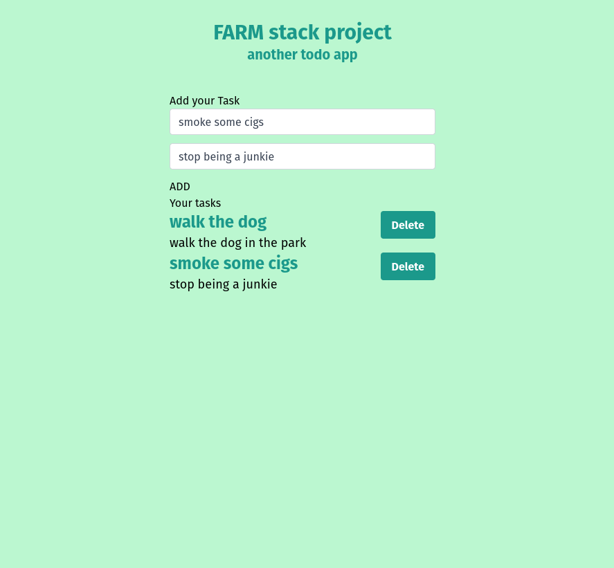
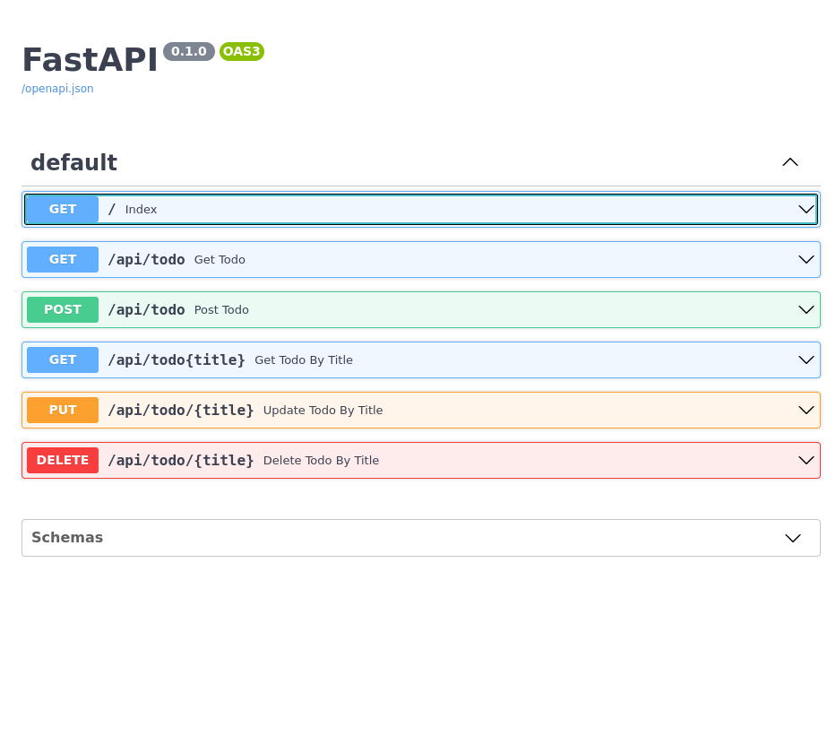
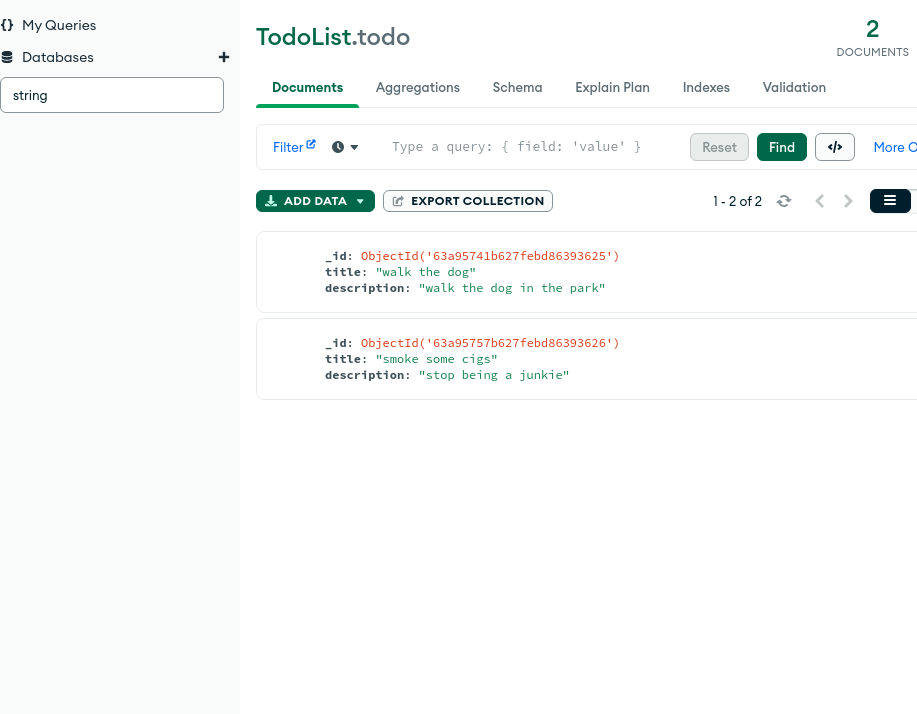

# REST API made using fastAPI, React and MongoDB
#### it is a simple todo application

### Front:

######React, Vite, Tailwind
### Back:

######fastAPI, uvicorn, motor
### Database:

######mongoDB on ATLAS
